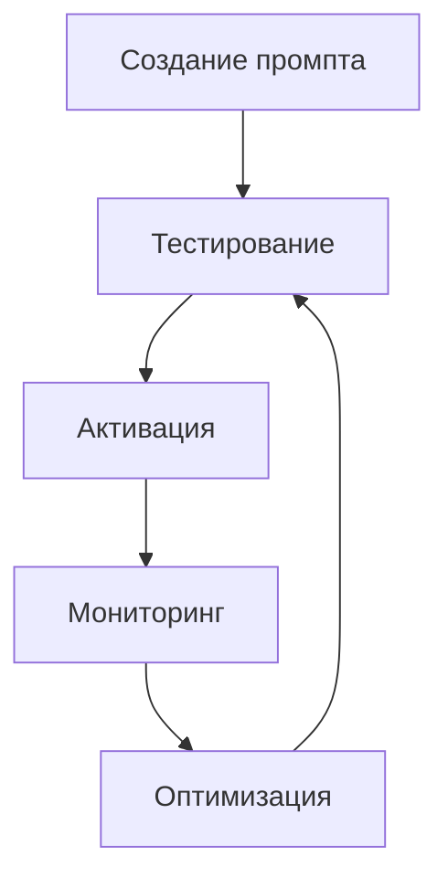

# 🎯 Руководство по управлению промптами

Полное руководство по управлению промптами в AI Researcher Console.

## 🚀 Быстрый старт

### 1. Миграция существующих промптов

```bash
# Установите переменные окружения
export SUPABASE_URL="https://your-project.supabase.co"
export SUPABASE_ANON_KEY="your-anon-key"
export ADMIN_EMAIL="admin@example.com"
export ADMIN_PASSWORD="your-admin-password"

# Запустите миграцию
python scripts/migrate_prompts.py
```

### 2. Проверка миграции

Скрипт автоматически проверит результат миграции и покажет:
- Количество созданных промптов
- Активные промпты по умолчанию
- Список профилей

## 📊 Структура промптов

### Типы промптов

1. **extraction** - извлечение данных с сайта
2. **classification** - классификация компании

### Профили

- `software` - Программные продукты и SaaS
- `edtech` - Образовательные технологии
- `fintech` - Финансовые технологии
- `pharma` - Фармацевтические компании
- И другие (см. полный список в коде)

## 🔧 Управление через API

### Получение всех промптов

```javascript
const response = await fetch('/functions/v1/manage-prompts', {
  headers: {
    'Authorization': `Bearer ${adminToken}`,
    'Content-Type': 'application/json'
  }
});

const { prompts } = await response.json();
```

### Создание нового промпта

```javascript
const newPrompt = {
  name: "software_extraction_v2",
  profile_type: "software",
  prompt_type: "extraction",
  content: "Extract information about software company...",
  variables: {
    content: "{content}"
  },
  is_default: false,
  is_active: true
};

const response = await fetch('/functions/v1/manage-prompts/create', {
  method: 'POST',
  headers: {
    'Authorization': `Bearer ${adminToken}`,
    'Content-Type': 'application/json'
  },
  body: JSON.stringify(newPrompt)
});
```

### Обновление промпта

```javascript
const updateData = {
  content: "Updated prompt content...",
  variables: {
    content: "{content}",
    additional_context: "{context}"
  }
};

const response = await fetch('/functions/v1/manage-prompts/update', {
  method: 'POST',
  headers: {
    'Authorization': `Bearer ${adminToken}`,
    'Content-Type': 'application/json'
  },
  body: JSON.stringify({
    id: "prompt-uuid",
    ...updateData
  })
});
```

### Установка активного промпта

```javascript
const response = await fetch('/functions/v1/manage-prompts/set-default', {
  method: 'POST',
  headers: {
    'Authorization': `Bearer ${adminToken}`,
    'Content-Type': 'application/json'
  },
  body: JSON.stringify({
    id: "prompt-uuid"
  })
});
```

## 🎨 Управление через Admin Panel

### Интерфейс для управления промптами

1. **Список промптов**
   - Фильтрация по профилю и типу
   - Поиск по названию
   - Сортировка по дате создания

2. **Редактор промптов**
   - Подсветка синтаксиса
   - Предварительный просмотр
   - Валидация переменных

3. **A/B тестирование**
   - Создание экспериментов
   - Настройка трафика
   - Анализ результатов

4. **Аналитика**
   - Производительность промптов
   - Время обработки
   - Процент успешных анализов

## 🔄 Workflow управления промптами

### 1. Создание нового промпта



### 2. A/B тестирование

1. **Создание варианта**
   - Копируйте существующий промпт
   - Внесите изменения
   - Установите как неактивный

2. **Настройка эксперимента**
   - Выберите контрольный и тестовый промпты
   - Установите процент трафика (например, 50/50)
   - Запустите эксперимент

3. **Анализ результатов**
   - Сравните метрики
   - Выберите лучший вариант
   - Активируйте победителя

### 3. Версионирование

- Каждое изменение создает новую версию
- Старые версии сохраняются для отката
- Возможность сравнения версий

## 📈 Аналитика и метрики

### Ключевые метрики

1. **Производительность**
   - Время обработки
   - Процент успешных анализов
   - Уровень уверенности

2. **Использование**
   - Количество использований
   - Популярные профили
   - Пиковые нагрузки

3. **Качество**
   - Точность классификации
   - Полнота извлечения данных
   - Ошибки и исключения

### Дашборд аналитики

```javascript
// Получение статистики промпта
const getPromptStats = async (promptId) => {
  const response = await fetch(`/functions/v1/prompt-analytics/${promptId}`);
  return await response.json();
};

// Метрики включают:
// - usage_count: количество использований
// - success_rate: процент успешных анализов
// - avg_processing_time: среднее время обработки
// - confidence_scores: распределение уверенности
```

## 🛠️ Переменные в промптах

### Поддерживаемые переменные

1. **Для extraction промптов:**
   - `{content}` - содержимое веб-страницы
   - `{url}` - URL сайта
   - `{domain}` - домен сайта

2. **Для classification промптов:**
   - `{structured_summary}` - структурированные данные
   - `{extraction_confidence}` - уверенность извлечения

### Пример использования

```javascript
const prompt = {
  content: `
    Analyze the following website content for {profile_type} companies:
    
    URL: {url}
    Content: {content}
    
    Extract key information about the company's business model,
    target audience, and services.
  `,
  variables: {
    profile_type: "software",
    url: "{url}",
    content: "{content}"
  }
};
```

## 🔐 Безопасность

### Права доступа

- **Админы**: полный доступ к управлению промптами
- **Пользователи**: только просмотр активных промптов
- **API**: аутентификация через JWT токены

### Валидация

- Проверка формата промптов
- Валидация переменных
- Защита от инъекций

## 🚨 Troubleshooting

### Частые проблемы

1. **Промпт не обновляется**
   - Проверьте кэш (TTL 5 минут)
   - Убедитесь что промпт активен
   - Проверьте права доступа

2. **Ошибки в анализе**
   - Проверьте переменные в промпте
   - Убедитесь в корректности синтаксиса
   - Проверьте логи API

3. **Медленная работа**
   - Оптимизируйте промпты
   - Уменьшите размер контента
   - Проверьте лимиты API

### Логи и отладка

```bash
# Логи Edge Functions
supabase functions logs manage-prompts

# Логи API сервиса
# (зависит от хостинга)

# Проверка кэша
# Промпты кэшируются на 5 минут
```

## 📚 Лучшие практики

### 1. Структура промптов

- Используйте четкие инструкции
- Разделяйте задачи на этапы
- Добавляйте примеры

### 2. Переменные

- Минимизируйте количество переменных
- Используйте понятные имена
- Документируйте назначение

### 3. Тестирование

- Тестируйте на реальных данных
- Сравнивайте с предыдущими версиями
- Измеряйте производительность

### 4. Мониторинг

- Отслеживайте ключевые метрики
- Настраивайте алерты
- Регулярно анализируйте результаты

## 🔄 Миграция и обновления

### Обновление промптов

1. **Создайте новую версию**
2. **Протестируйте на части трафика**
3. **Активируйте при успешных результатах**
4. **Откатите при проблемах**

### Резервное копирование

- Все версии сохраняются автоматически
- Возможность экспорта в JSON
- Восстановление из резервных копий

## 📞 Поддержка

### Документация

- [Supabase Docs](https://supabase.com/docs)
- [Edge Functions](https://supabase.com/docs/guides/functions)
- [Row Level Security](https://supabase.com/docs/guides/auth/row-level-security)

### Контакты

- GitHub Issues для багов
- Discord для вопросов
- Email для критических проблем

---

**Готово!** Теперь вы можете эффективно управлять промптами без передеплоя приложения. 🎉
